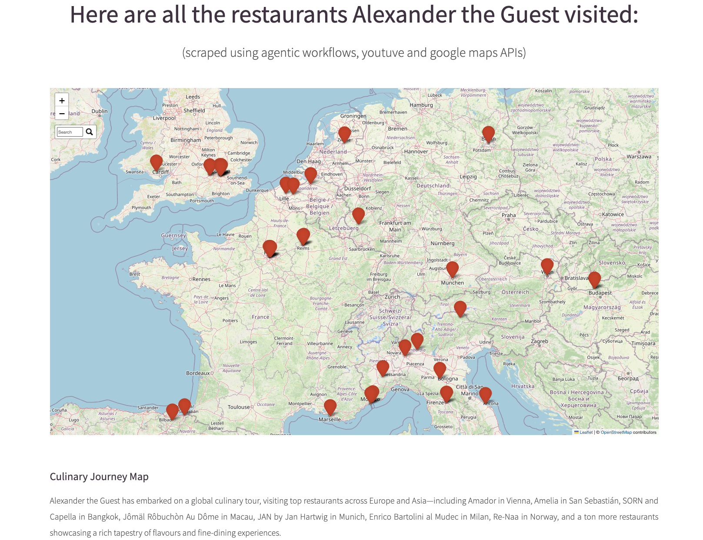

# YouTube CrewAI Scraper & Mapper (Agentic scraper for YouTube videos)

A fully automated pipeline to discover restaurant and location information from YouTube videos using CrewAI agents, enrich the data with geolocation, and generate an interactive Folium map that refreshes automatically every month.

## Live Demo
<p align="left">
  <a href="https://unikill066.github.io/youtube_crewAI_scraper_mapper/" 
     style="background-color:#4c5ca6;color:white;padding:10px 20px;border-radius:5px;text-decoration:none;font-weight:bold;">
    ▶️ View Live Demo
  </a>
</p>

## Preview of the page

| Hero Page                                             | Interactive Map Page                                             |
|-------------------------------------------------------|------------------------------------------------------------------|
|  |  |


## Table of Contents

* [Features](#features)
* [Directory Structure](#directory-structure)
* [Prerequisites](#prerequisites)
* [Installation](#installation)
* [Configuration](#configuration)
* [Usage](#usage)
* [Scheduling Monthly Refresh](#scheduling-monthly-refresh)
* [Development & Testing](#development--testing)
* [Contributing](#contributing)
* [License](#license)


## Features

1. **YouTube Scraping**

   * Fetches all video metadata from a target YouTube channel using the YouTube Data API.
2. **Agentic Transcript Extraction**

   * Uses CrewAI agents in `crew.py` to pull unstructured transcript data for each video.
3. **Structured Parsing**

   * Parses transcripts to extract restaurant names, locations, and other relevant details into a CSV.
4. **Geocoding**

   * Enriches each record with latitude and longitude via the Google Maps Geocoding API.
5. **Interactive Mapping**

   * Generates an elaborate Folium map (HTML) plotting all points, with clustering and popups.
6. **Automated Monthly Refresh**

   * Supports cron‐style scheduling for end‐to‐end pipeline runs, producing a new map each month.


## Directory Structure

```
.
├── bin/                      # executable scripts and entrypoints
├── data/                     # raw JSON / transcripts and parsed CSV outputs
├── webpage/                  # generated HTML map and assets
├── constants.py              # API keys & configuration defaults
├── crew.py                   # crewAI agent workflow for transcript extraction
├── services.py               # YouTube & Google Maps API wrappers, parsing logic
├── data_test_nb.ipynb        # Jupyter notebook for exploratory data analysis
├── .gitignore
├── LICENSE
└── README.md
```


## Prerequisites

* **Python 3.8+**
* A **YouTube Data API** Key with read permissions for channel/videos.
* An **OPENAI API** Key.
* A **Google Maps Geocoding API** Key.
* (Optional) [virtualenv](https://docs.python.org/3/library/venv.html) or [conda](https://docs.conda.io/) for isolated environments.


## Installation

1. **Clone the repository**

   ```bash
   git clone https://github.com/unikill066/youtube_crewAI_scraper_mapper.git
   cd youtube_crewAI_scraper_mapper
   ```

2. **Create & activate a virtual environment**

   ```bash
   python3 -m venv .venv
   source .venv/bin/activate
   ```

3. **Install dependencies**

   ```bash
   pip install -r requirements.txt
   ```

   > *If `requirements.txt` is not present, install manually:*
   > `pip install google-api-python-client google-auth requests pandas folium python-dotenv`


## Configuration

Edit `constants.py` (or set environment variables) with your API credentials:

YOUTUBE_CHANNEL_ID = "UCxxxxxxxxxxxxxxxx"

```python
# constants.py
OPENAI_API_KEY     = "<YOUR_OPENAI_API_KEY>"  # replace it will claude / gemini etc.
YOUTUBE_API_KEY    = "<YOUR_YOUTUBE_API_KEY>"
GOOGLE_MAPS_API_KEY = "<YOUR_GOOGLE_MAPS_API_KEY>"
```
Or simply add a `.env` file containing the keys at the directory level [***preferred***]

Alternatively, export keys in your shell:

```bash
export YOUTUBE_API_KEY="..."
export OPENAI_API_KEY="..."
export GOOGLE_MAPS_API_KEY="..."
```


## Usage

Run the end-to-end pipeline with a single command:

```bash
python bin/fetch_yt_vid_information.py  # scrapes youtube video content for video metadata
python services.py  # uses crew.py(custom tool, agent and tool) to fetch video information
python bin/fetch_location_for_plotting.py  # geocodes each entry to append latitude/longitude and generates a .html map

```

This will:

1. Scrape video metadata from the specified YouTube channel.
2. Invoke CrewAI agents to fetch and transcribe each video.
3. Parse transcripts to extract restaurant & location details into a CSV.
4. Geocode each entry to append latitude/longitude.
5. Render an interactive Folium map in `webpage/data/*.html`.

Open `webpage/data/*.html` in your browser to explore.


## Scheduling Monthly Refresh

To regenerate the map on the 1st of every month at 2 AM, add a cron job:

```cron
0 2 1 * * cd /path/to/youtube_crewAI_scraper_mapper && \
  .venv/bin/python bin/run_pipeline.py && \
  git add webpage/map.html data/processed/locations.csv && \
  git commit -m "Monthly map refresh" && \
  git push origin main
```

This ensures your map and CSV stay up to date automatically.

## License

This project is licensed under the **MIT License**. See [LICENSE](LICENSE) for details.
